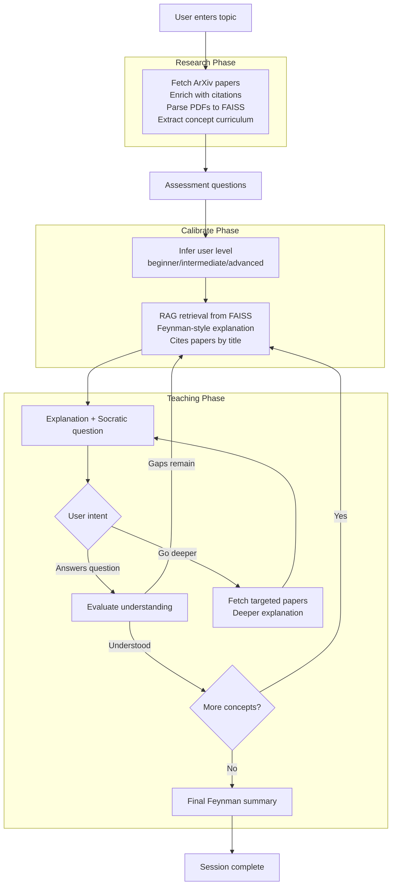

# Feynman

*Learn any technical topic from first principles - taught by research papers, not blog posts.*

Feynman is an agentic research assistant that takes you from zero to deep understanding of any technical topic. You provide a topic, the agent autonomously retrieves and analyzes relevant papers from ArXiv, builds a structured concept curriculum, then teaches you interactively. It checks your understanding at each step before moving forward and re-explains concepts using different analogies when needed.

Inspired by Richard Feynman's principle: **if you can't explain it simply, you don't understand it yet.**

## How It Works

The system operates in three phases:

1. **Research** - Fetch ArXiv papers, enrich with citation metadata, parse PDFs, and extract a conceptually ordered curriculum
2. **Calibrate** - Ask assessment questions to infer your background level (beginner, intermediate, or advanced)
3. **Teach** - Deliver paper-grounded explanations, check understanding through Socratic questions, and iterate until mastery

---

## Architecture



---

## Evaluation Results

**Vision Transformers Case Study**
- Concepts Evaluated: 6
- Avg Feynman Score: 4.00/5 (target >= 3.8) ✓
- Avg Hallucination Rate: 18.9% (target < 5%) - in progress

| Concept | Feynman Score | Hallucination Rate |
|---|---|---|
| Vision Transformer (ViT) Architecture | 4/5 | 40.0% |
| Self-Supervised Learning (SSL) in Vision | 4/5 | 26.3% |
| Attention Mechanisms and Locality Bias | 4/5 | 7.1% |
| Computational Efficiency and Model Scaling | 4/5 | 12.5% |
| Cross-Domain and Multi-Modal Adaptation | 4/5 | 9.5% |
| Task-Specific Architectural Optimization | 4/5 | 17.6% |

**Targets:** avg Feynman score >= 3.8 (Achieved) - hallucination rate < 5% (In progress)

---

## Design Decisions

### Why LangGraph Over Simple Prompt Chains
Teaching requires cycles: explain - check - re-explain - check again. A linear prompt chain cannot model this naturally. LangGraph's `StateGraph` treats the retry loop as a first-class directed graph with conditional edges, making the flow explicit rather than buried in conditional logic. The typed `AgentState` also aids debugging - you can inspect exactly what changed after each node execution.

### Why ArXiv and Semantic Scholar Over Web Search
Web search returns a mix of blog posts, tutorials, and marketing copy — high noise with unverifiable claims. ArXiv papers are peer-reviewed and written by researchers who built the systems being explained. Semantic Scholar adds citation counts, a reliable proxy for foundational importance: a paper cited 3,000 times is almost certainly more essential than one cited 12 times. Every explanation must cite a paper by title, making the product's claims auditable.

### Why Local Embeddings Over API Services
`all-MiniLM-L6-v2` runs on-device with no API calls, minimal latency, and zero per-token cost. At the scale of a single session (~1,200 chunks from 10 papers), local inference is instantaneous. External embedding APIs would add network overhead, per-session costs, and create a hard dependency that breaks deployment if credentials are missing. The model is small enough (80 MB) to embed directly.

### Understanding Evaluation in the check_node
"Understood" means the user can apply or extend the concept, not merely recall it. The evaluation prompt explicitly credits correct intuition even with imperfect terminology. This is the core Feynman principle: advancement requires genuine comprehension, not just right-sounding words. When understanding gaps are detected, `reexplain=True` triggers a completely different analogy in the RE_EXPLAIN_CONCEPT prompt - not a slower repetition of the original explanation.

---

## Tech Stack

| Component | Technology |
|---|---|
| Agent Orchestration | LangGraph `StateGraph` |
| Language Model | Google Gemini (`gemini-2.0-flash`) |
| Paper Retrieval | ArXiv API + Semantic Scholar API |
| PDF Parsing | PyMuPDF (`fitz`) |
| Token Counting | tiktoken |
| Embeddings | sentence-transformers `all-MiniLM-L6-v2` (MPS) |
| Vector Store | FAISS `IndexFlatIP` |
| User Interface | Gradio 6 |
| Deployment | HuggingFace Spaces (Docker) |

---

## Getting Started

```bash
git clone https://github.com/YOUR_USERNAME/Feynman_Researcher
cd Feynman_Researcher

python -m venv .venv && source .venv/bin/activate
pip install -r requirements.txt

cp .env.example .env
# Add your Google API key to .env:  GOOGLE_API_KEY=AIza...

python app.py
# Open http://localhost:7860
```

Get a free Gemini API key at [aistudio.google.com/apikey](https://aistudio.google.com/apikey).

---

## Known Limitations

**Performs well on:**
- Topics with substantial ArXiv coverage: deep learning, NLP, computer vision, reinforcement learning
- Foundational ML papers (transformers, diffusion models, graph neural networks) — well-cited with clean PDFs
- Intermediate learners with some ML background — calibration is most accurate for this level

**May underperform on:**
- Very recent topics (less than 6 months old) — insufficient papers to build a solid curriculum
- Highly mathematical subjects — PDF parsing loses LaTeX equations, removing proofs from context
- Interdisciplinary topics (e.g., "ML for drug discovery") — concept ordering is less reliable across diverse paper sets
- Two-column PDF layouts — PyMuPDF extracts them as garbled text, breaking section detection

---

## Project Structure

```
feynman/
├── agent/
│   ├── graph.py        # LangGraph StateGraph definition
│   ├── nodes.py        # Node implementations (research/assess/explain/check/drill/summarize)
│   ├── prompts.py      # Prompt templates
│   └── state.py        # AgentState TypedDict
├── retrieval/
│   ├── arxiv_client.py      # ArXiv API wrapper
│   ├── semantic_scholar.py  # Semantic Scholar enrichment
│   ├── pdf_parser.py        # PyMuPDF + tiktoken chunking
│   └── vector_store.py      # FAISS + sentence-transformers
└── eval/
    └── citation_checker.py  # Hallucination measurement
app.py              # Gradio interface
notebooks/
└── eval_feynman.ipynb  # Evaluation harness
```
